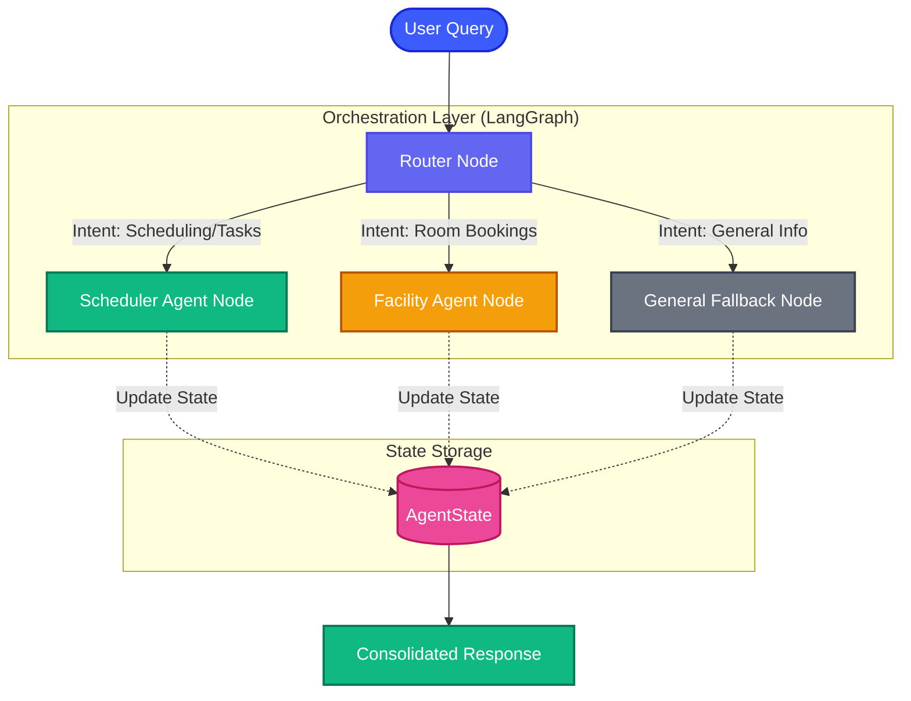

# Smart Campus Agent System (smart-campus-ops)

A multi-agent, automated operations and scheduling system designed to optimize daily campus activities. Powered by a Next.js frontend and a FastAPI backend with LangGraph multi-agent orchestration.

## Project Overview

The **Agentic AI-Driven Smart Campus Operations Management System** addresses the limitations of traditional, reactive campus management systems. Modern educational campuses operate as complex ecosystems, managing scheduling, resource allocation, and facility operations. However, legacy systems are often rigid, disjointed, and heavily dependent on manual supervision, leading to delayed responses, timetable conflicts, and high operational costs.

This project introduces an **Agentic AI-driven campus management framework** that enables intelligent, real-time monitoring and decision-making. By utilizing multiple autonomous, collaborative agents—specializing in areas like scheduling and facility coordination—the system proactively manages campus operations, adapts dynamically to changing conditions, and ensures efficient resource utilization with minimal human intervention.

## Architecture

### Visual Flow Diagram


```
smart-campus-ops/
├── apps/
│   └── web/            # Next.js Client Dashboard (TypeScript, Tailwind)
└── services/
    └── backend/        # Orchestration Engine & Server (Python 3.11+, FastAPI, LangGraph)
```

### Components

1. **Frontend (apps/web)**: Next.js frontend built with Tailwind CSS. It provides a visual dashboard for administrators and students to interact with campus agents, view scheduled operations, check room bookings, and trigger automated scripts.
2. **Backend (services/backend)**: Python backend running FastAPI. It hosts REST endpoints, manages real-time WebSockets, and compiles a LangGraph multi-agent orchestration workflow to route queries and delegate tasks (e.g., room booking, timetable scheduling).

## Setup & Running

### 1. Backend Service
Make sure you have Python 3.11+ installed.
```bash
cd services/backend
python -m venv venv
# Windows (PowerShell):
.\venv\Scripts\python main.py

# Alternatively, activate the virtualenv first:
# Windows (PowerShell): .\venv\Scripts\Activate.ps1
# Windows (CMD): venv\Scripts\activate.bat
# Unix/macOS: source venv/bin/activate

pip install -r requirements.txt
python main.py
```
*The server will start at `http://localhost:8000`.*

### 2. Web Application
Make sure you have Node.js 18+ installed.
```bash
cd apps/web
npm install
npm run dev
```
*The client dashboard will start at `http://localhost:3000`.*

## License
MIT
