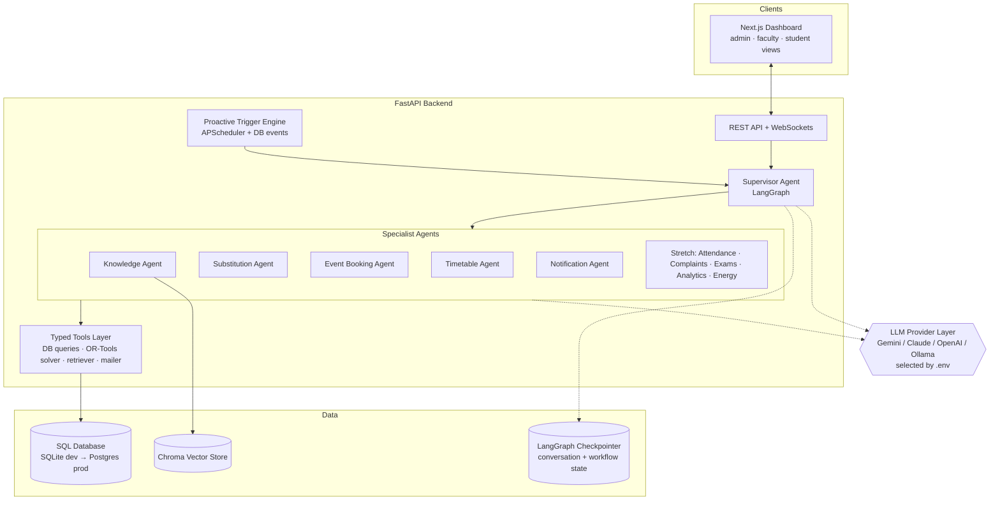
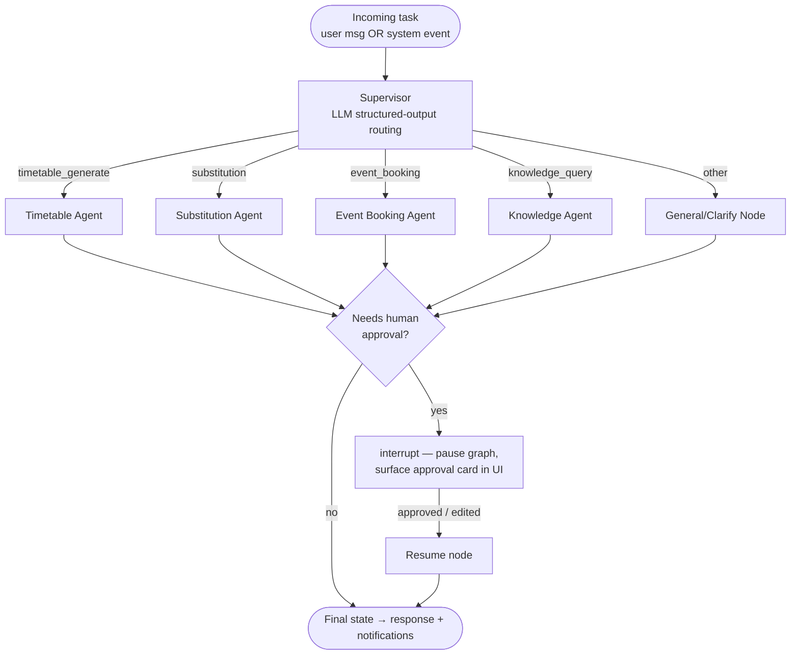

# 02 — Architecture

## 1. System overview



**Two entry points into the agent graph:**
1. **Chat / API** — a user message arrives at `POST /api/agent/chat`.
2. **Proactive triggers** — APScheduler jobs and DB lifecycle events (e.g. *leave approved*)
   inject a synthetic task message into the same graph. Same agents, no user needed.

---

## 2. Agent workflow (LangGraph)

### 2.1 Supervisor pattern

The current keyword router is replaced by an **LLM supervisor with structured output**:



- Supervisor prompt returns `{"route": "...", "task_spec": {...}}` via structured output —
  no keyword matching.
- Each specialist is a **ReAct-style agent subgraph**: LLM + its own toolset, looping
  think → tool call → observe until done.
- **Human-in-the-loop** uses LangGraph `interrupt()` + checkpointer: the graph pauses,
  the pending approval appears in the dashboard, and the graph resumes exactly where it
  stopped when the human clicks Approve/Reject — even days later.

### 2.2 The tools layer (critical design rule)

Agents never touch the DB or external systems from prompt text. Every capability is a
**typed tool** (Python function with Pydantic schema) the LLM can call:

| Tool group | Examples |
|---|---|
| Timetable | `get_timetable(section, week)`, `solve_timetable(spec) → OR-Tools`, `apply_timetable_diff(diff)` |
| People | `get_teacher_load(teacher)`, `find_free_teachers(slot, subject?)` |
| Venues | `check_venue_availability(venue, range)`, `create_booking(...)`, `list_alternative_venues(...)` |
| Knowledge | `search_documents(query, k)` → Chroma retriever |
| Notify | `send_notification(audience, template, payload)` |
| Analytics (stretch) | `run_readonly_sql(query)` — SELECT-only, validated, row-limited |

This keeps agents auditable (every action is a logged tool call — the dashboard's workflow
trace shows these) and safe (tools enforce permissions, the LLM cannot).

### 2.3 Proactive trigger engine

| Trigger | Schedule/Event | Wakes |
|---|---|---|
| Leave approved | DB event | Substitution Agent |
| Daily 06:00 | cron | Substitution Agent (re-check today's absences) |
| Weekly Mon 07:00 | cron | Attendance Sentinel (stretch) |
| Booking pending > 24h | cron sweep | Notification Agent (nag approver) |
| Complaint SLA breach | cron sweep | Complaint Agent escalation (stretch) |
| Sensor reading anomaly | simulated feed | Energy Watchdog (stretch) |

Implementation: **APScheduler** inside the FastAPI process (sufficient for this scale) posts
task messages into the LangGraph supervisor with a `source: "system"` flag.

---

## 3. Data model (SQLAlchemy)

```
users(id, name, email, role[admin|faculty|student], section_id?, password_hash)
teachers(id, user_id, dept, max_hours_per_day)
subjects(id, code, name, dept, periods_per_week, needs_lab, semester)
teacher_subjects(teacher_id, subject_id)            -- who can teach what
sections(id, name, dept, semester, strength)
rooms(id, name, type[classroom|lab|auditorium|seminar|ground], capacity)
timeslots(id, day, period_no, start, end)
timetable_entries(id, section_id, subject_id, teacher_id, room_id, timeslot_id,
                  status[active|substituted|cancelled], version)
leaves(id, teacher_id, from_date, to_date, reason, status[pending|approved|rejected])
substitutions(id, timetable_entry_id, date, original_teacher_id, substitute_teacher_id,
              status[proposed|approved|rejected], plan_id)
events(id, title, organizer_id, description, expected_headcount)
bookings(id, event_id, room_id, date, start, end, status[pending|approved|rejected|cancelled])
approvals(id, kind[leave|substitution_plan|booking], ref_id, approver_id, status, decided_at,
          langgraph_thread_id)                      -- resumes the paused graph
documents(id, title, file_path, uploaded_by, indexed_at)          -- RAG corpus
notifications(id, user_id, channel, title, body, read, created_at)
-- stretch: attendance_records, complaints, exam_slots, sensor_readings
```

Key ideas:
- `timetable_entries.version` → every solver run/substitution creates a new version;
  history is preserved and diffs are shown in the UI.
- `approvals.langgraph_thread_id` → connects a human approval click to the paused
  LangGraph thread so the workflow resumes with full context.

---

## 4. API surface (FastAPI routers, one per domain)

```
POST /api/agent/chat                 # unified chat → supervisor (existing, upgraded)
WS   /api/agent/stream               # live agent trace (tool calls, node steps)
GET  /api/timetable/{section}        # grid data
POST /api/timetable/generate         # kick off Timetable Agent
POST /api/leaves        GET /api/leaves            # apply / list
POST /api/approvals/{id}/decide      # approve/reject → resumes LangGraph thread
POST /api/bookings      GET /api/bookings          # event bookings
POST /api/documents/upload           # RAG ingestion
GET  /api/notifications              # in-app inbox
GET  /api/health                     # existing
```

Auth: JWT bearer tokens; role checked per route (`admin`, `faculty`, `student`).

---

## 5. Target repo structure

```
smart-campus-ops/
├── docs/                          # ← you are here (design source of truth)
├── apps/web/                      # Next.js dashboard
│   └── src/app/
│       ├── page.tsx               # overview (exists)
│       ├── chat/  timetable/  leaves/  bookings/  knowledge/  approvals/
│       └── components/            # split the monolith page.tsx as features land
└── services/backend/
    ├── main.py
    └── app/
        ├── api/                   # one router file per domain
        ├── agents/
        │   ├── supervisor.py      # LLM routing (replaces keyword router)
        │   ├── graph.py           # graph assembly + checkpointer
        │   ├── state.py           # AgentState
        │   └── specialists/       # timetable.py, substitution.py, booking.py, knowledge.py, notify.py
        ├── tools/                 # typed tools, grouped per domain
        ├── solver/                # OR-Tools CP-SAT timetable model
        ├── rag/                   # ingest.py, retriever.py
        ├── db/                    # models.py, session.py, seed.py
        ├── triggers/              # APScheduler jobs + DB event hooks
        └── core/
            ├── config.py          # settings (exists)
            └── llm.py             # ★ provider-agnostic LLM factory (see 03-TECH-STACK)
```

Migration note: the existing `agents/nodes/scheduler.py` and `facility.py` evolve into
`specialists/substitution.py` and `specialists/booking.py`; the keyword `router_node` is
replaced by `supervisor.py`. `AgentState` gains `task_spec`, `pending_approval`, `source`
fields but keeps its shape (messages, steps, params, final_response) so the existing
frontend trace UI keeps working.

---

## 6. Security & safety rails

- Tools enforce **role permissions** (a student's chat cannot call `apply_timetable_diff`).
- Analytics SQL tool is **SELECT-only** with a validator + `LIMIT` cap.
- All state-changing agent actions route through an **approval** unless whitelisted as
  low-risk (e.g. sending a notification).
- Every tool call is logged to the workflow trace → full auditability, shown live in the UI.
- CORS narrowed from `*` to the frontend origin before any deployment.
